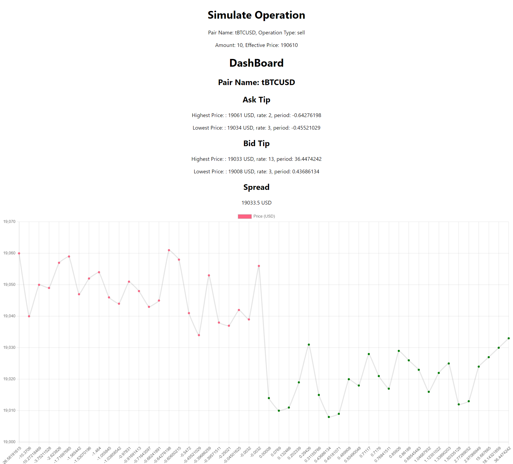
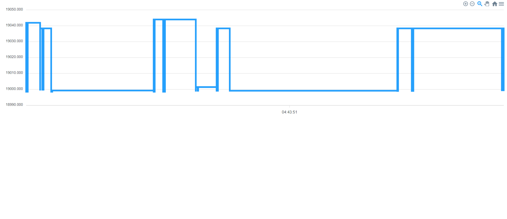

# market status project

## Steps to start projects

### api

* cd api
* npm i
* npm run start:dev

### web-socket

* cd web-socket
* npm i
* npm run start:dev

### web-app

* cd web-app
* npm i
* npm run start

## Change Log

## [1.0.0] - 2022-09-20

### Added

- Operation simulation feature
    - ESLint
    - Bitfinex integration
- OrderBook Websocket
  - Bittrex integration
- Demo WebApp
  - Static dashboard
  - Dynamic dashboard
- Unit tests
- Documentation

### Changed

### Fixed

## WebApp Demo

### Static Dashboard

### Dynamic Dashboard

## [Diagrams](./market-status.drawio)

## Branching strategy

[Git flow](https://www.atlassian.com/git/tutorials/comparing-workflows/gitflow-workflow#:~:text=Gitflow%20is%20a%20legacy%20Git,software%20development%20and%20DevOps%20practices.)

- feature/ticket-001-initial-project-setup
- feature/ticket-002-implement-tips-feature
- feature/ticket-003-implement-operation-simulation-feature
- feature/ticket-004-implement-websocket-feature
- feature/ticket-005-add-unit-tests
- feature/ticket-006-add-web-app
- feature/ticket-007-add-documentation

## Helpful Links

* https://docs.bitfinex.com/docs/rest-public
* https://bittrex.github.io/api/v3
* https://expressjs.com/
* https://www.npmjs.com/package/forever